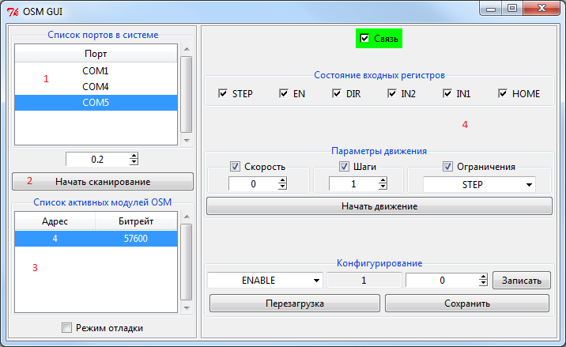

## python-osm ##

Библиотека для работы с контроллерами шагового двигателя OSM-17RA / OSM-42RA / OSM-88RA по протоколу Modbus

### 1. Работа с консольной версией ###

Программа может работать в двух режимах

- Режим **Scanner**
- Режим **User**

        usage: osm-console [-h] --port [PORT] [--timeout [VALUE]] [--debug] [--scan]
                           [--baudrate [RATE]] [--unit [UNIT]]
                           [--reset | --state | --get KEY | --set KEY VALUE | --move [ARG [ARG ...]]]

        OSM stepper driver controller command-line option

        optional arguments:
          -h, --help              show this help message and exit
          --port [PORT]           Set used port name
          --timeout [VALUE]       Set used timeout in second
          --debug                 Print debug information

        Scanner:
          --scan                  Scan available modules

        User:
          --baudrate [RATE]       Set used OSM baudrate
          --unit [UNIT]           Set used OSM address
          --reset                 Send RESET request
          --state                 Read OSM state
          --get KEY               Read config value. Possible KEY values: ['Accel',
                                  'Address', 'BaudRateIndex', 'Command', 'Current',
                                  'Direction', 'Enable', 'EncoderPosition', 'EnCounter',
                                  'EndSpeed', 'Inputs', 'IntCounter', 'IntEn',
                                  'IntMode', 'Microstep', 'Output', 'Position',
                                  'RtsDelay', 'SleepCurrent', 'SleepTime', 'Speed',
                                  'SpeedCurrent', 'StartSpeed', 'StepsBefDecel',
                                  'StepsCounter', 'StepsNumber', 'SystemId',
                                  'UartDelay']
          --set KEY VALUE         Write config value. See --get for possible KEY values
          --move [ARG [ARG ...]]  Send move command with args: Speed, Steps, Edge

##### Режим Scanner #####

Пример использования режима Scanner:

	osm-console --port COM1 --scan

Пример использования режима Scanner с выводом отладочной информации:

	osm-console --port COM1 --scan --debug

##### Режим User #####

Пример использования режима User:

	osm-console --port COM1 --baudrate 57600 --unit 1 --state
	osm-console --port COM1 --baudrate 57600 --unit 1 --get Address
	osm-console --port COM1 --baudrate 57600 --unit 1 --set Enable 1
	osm-console --port COM1 --baudrate 57600 --unit 1 --move 100 1000 IN1

Пример использования режима User с выводом отладочной информации:

	osm-console --port COM1 --baudrate 57600 --unit 1 --state --debug

### 2. Работа с графической версией ###

### 3. Работа с симулятором ###

	usage: osm-simulator [-h] [--tcp | --udp | --serial PORT]

	OSM stepper simulator command-line option

	optional arguments:
	  -h, --help     show this help message and exit
	  --tcp          Use TCP simulator
	  --udp          Use UDP simulator
	  --serial PORT  Use SERIAL simulator

Пример использования симулятора:

    osm-simulator --serial COM1
